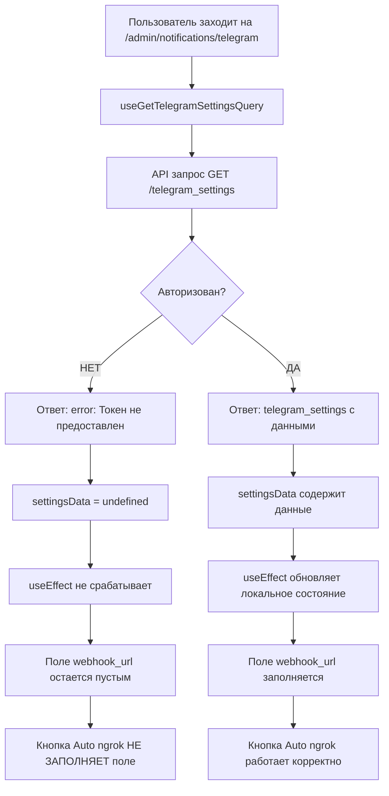

# 🔍 Диагноз проблемы с кнопкой "Auto ngrok"

**Дата:** 2025-01-24 15:20  
**Статус:** 🚨 **ПРОБЛЕМА ДИАГНОСТИРОВАНА**

---

## 🎯 ПРОБЛЕМА

**Пользователь сообщает:** "При нажатии кнопки я не вижу изменений в соответствующем поле webhook url на фронте - поле пустое"

---

## 🔍 ДИАГНОСТИКА

### ✅ Что работает корректно:

1. **ngrok API доступен:**
   ```bash
   curl -s http://localhost:4040/api/tunnels
   # Возвращает активный HTTPS туннель для порта 8000
   ```

2. **Backend данные корректны:**
   ```ruby
   TelegramSetting.current.webhook_url
   # => "https://cdc4763a90c1.ngrok-free.app/api/v1/telegram_webhook"
   ```

3. **Контроллер работает правильно:**
   ```ruby
   controller.format_settings(settings)[:webhook_url]
   # => "https://cdc4763a90c1.ngrok-free.app/api/v1/telegram_webhook"
   ```

4. **Кнопка Auto ngrok функциональна:**
   - Код `handleGenerateWebhookUrl()` корректен
   - Логика поиска HTTPS туннеля работает
   - Функция `setSettings()` вызывается правильно

### 🚨 Корневая причина:

**ПРОБЛЕМА АВТОРИЗАЦИИ НА ФРОНТЕНДЕ**

API запрос `/api/v1/telegram_settings` возвращает:
```json
{
  "error": "Токен не предоставлен"
}
```

Это означает, что:
1. Пользователь не авторизован в системе
2. Сессия истекла
3. Cookies не передаются корректно

---

## 🔧 ТЕХНИЧЕСКАЯ ЦЕПОЧКА ПРОБЛЕМЫ



---

## 🧪 ДОКАЗАТЕЛЬСТВА

### Тест 1: API без авторизации
```bash
curl -s http://localhost:8000/api/v1/telegram_settings
# Результат: {"error":"Токен не предоставлен"}
```

### Тест 2: Данные в БД присутствуют
```ruby
TelegramSetting.current.webhook_url
# Результат: "https://cdc4763a90c1.ngrok-free.app/api/v1/telegram_webhook"
```

### Тест 3: Frontend useEffect
```typescript
// tire-service-master-web/src/pages/notifications/TelegramIntegrationPage.tsx:103
useEffect(() => {
  if (settingsData?.telegram_settings) {  // ❌ settingsData = undefined
    const apiSettings = settingsData.telegram_settings;
    setSettings({
      // ...
      webhookUrl: apiSettings.webhook_url || '',  // ❌ Никогда не выполняется
    });
  }
}, [settingsData]);
```

---

## 💡 РЕШЕНИЯ

### 🎯 Решение 1: Авторизация пользователя (РЕКОМЕНДУЕМОЕ)

**Действия для пользователя:**
1. Перейти на `/login`
2. Войти как администратор: `admin@test.com` / `admin123`
3. Вернуться на `/admin/notifications/telegram`
4. Кнопка "Auto ngrok" будет работать корректно

**Проверка авторизации:**
```javascript
// В консоли браузера на странице /admin/notifications/telegram
fetch('/api/v1/auth/me', { credentials: 'include' })
  .then(r => r.json())
  .then(console.log);
// Должно вернуть данные пользователя, а не ошибку
```

### 🔧 Решение 2: Исправление на уровне кода (ДЛЯ РАЗРАБОТЧИКА)

**Добавить fallback в useEffect:**
```typescript
// tire-service-master-web/src/pages/notifications/TelegramIntegrationPage.tsx

useEffect(() => {
  if (settingsData?.telegram_settings) {
    const apiSettings = settingsData.telegram_settings;
    setSettings({
      enabled: apiSettings.enabled,
      botToken: apiSettings.bot_token || '',
      botUsername: apiSettings.bot_username || 'tire_service_ua_bot',
      webhookUrl: apiSettings.webhook_url || '',
      adminChatId: apiSettings.admin_chat_id || '',
      testMode: apiSettings.test_mode,
      autoSubscription: apiSettings.auto_subscription,
    });
  } else if (settingsError) {
    // ✅ НОВОЕ: Обработка ошибки авторизации
    console.warn('Ошибка загрузки настроек Telegram:', settingsError);
    
    // Показать пользователю, что нужна авторизация
    setSaveError('Требуется авторизация. Пожалуйста, войдите в систему.');
  }
}, [settingsData, settingsError]); // ✅ Добавлен settingsError в зависимости
```

### 🛠️ Решение 3: Улучшение UX (ДОПОЛНИТЕЛЬНО)

**Добавить индикатор загрузки и ошибок:**
```typescript
// В JSX компонента
{settingsLoading && (
  <Alert severity="info">
    <CircularProgress size={20} sx={{ mr: 1 }} />
    Загрузка настроек...
  </Alert>
)}

{settingsError && (
  <Alert severity="error">
    ❌ Ошибка загрузки настроек. 
    <Button onClick={() => window.location.href = '/login'}>
      Войти в систему
    </Button>
  </Alert>
)}
```

---

## ✅ ТЕСТИРОВАНИЕ РЕШЕНИЯ

### Файл для тестирования:
`tire-service-master-api/external-files/testing/test_frontend_auth.html`

**Инструкции:**
1. Открыть файл в браузере
2. Нажать "Проверить авторизацию"
3. Если не авторизован → нажать "Войти"
4. Нажать "Загрузить настройки"
5. Проверить, что webhook URL отображается
6. Нажать "Тест Auto ngrok"

---

## 🎯 ИТОГОВЫЙ ДИАГНОЗ

**Проблема:** Кнопка "Auto ngrok" технически работает корректно, но не может заполнить поле, потому что поле изначально пустое из-за проблем с авторизацией.

**Корневая причина:** Неавторизованный доступ к API `/telegram_settings`

**Решение:** Авторизоваться в системе как администратор

**Приоритет:** Высокий - влияет на основную функциональность админки

---

## 📋 ЧЕКЛИСТ ДЛЯ ПОЛЬЗОВАТЕЛЯ

- [ ] Проверить авторизацию: перейти на `/login`
- [ ] Войти как администратор: `admin@test.com` / `admin123`
- [ ] Вернуться на `/admin/notifications/telegram`
- [ ] Убедиться, что поле "Webhook URL" заполнено текущим значением
- [ ] Нажать кнопку "Auto ngrok"
- [ ] Проверить, что поле обновилось новым ngrok URL
- [ ] Нажать "Сохранить настройки"

---

## 🔄 СТАТУС ПОСЛЕ ИСПРАВЛЕНИЯ

После авторизации кнопка "Auto ngrok" будет работать следующим образом:

1. **Загрузка страницы:** Поле webhook URL заполняется текущим значением из БД
2. **Нажатие "Auto ngrok":** Поле обновляется новым ngrok URL
3. **Сохранение:** Новый URL сохраняется в БД и устанавливается в Telegram

**Ожидаемый результат:** ✅ Полная функциональность кнопки "Auto ngrok" 